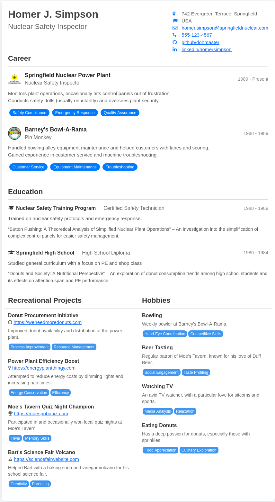

# Jinja2 CV Generator
I use this CV template for making CV PDFs.
The CSS is slightly different for PDFs, using higher contrast colors.

# Example

[Homer J. Simpson's CV as HTML](output.html)

[Homer J. Simpson's CV as PDF](output.pdf)



# Rendering
Have a python environment ready with jinja installed
```
python -m venv venv
source venv/bin/activate
pip install jinja2
```
Then render using:
```
python render.py [--data data.json] [--index index.html] [--output output.html]
```

or just use `python render.py`