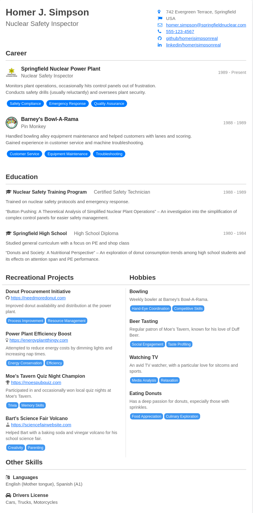

# Jinja2 CV Generator
This CV template is based on Jinja2 and can be used to generate your CV as HTML.
PDFs can be created by printing the site to PDF.

# Usage
Have a python environment ready with jinja installed
```
python -m venv venv
source venv/bin/activate
pip install jinja2
```
Then render using:
```
python render.py [--data data.json] [--index index.html] [--output output.html]
```

or just use `python render.py`


# Example

